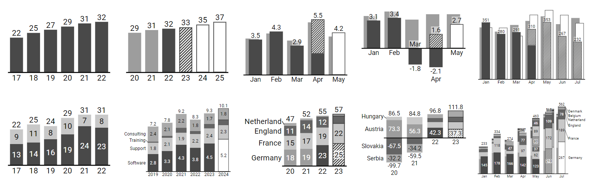

# Standard-Charts

<a href="https://github.com/ruqzuq/standard-charts/tree/main/dist">

</a>
<a href="https://ruqzuq.com/standard-charts">

</a>

<a href="https://ruqzuq.com/standard-charts" align="center">

</a>

[Standard-Charts](https://ruqzuq.com/standard-charts) is an open-source chart-library inspired by **IBCS** (unlicensed)[1]. It empowers developers to unite modern and timeless corporate financial visualization.

---

## First steps

These steps are appropriate for plain JavaScript. Different approaches may be needed when using a framework.

First, include the library.

```jsx
<script src="./standard-charts_v0.1.0.js"></script>
```

Then call the API and include the generated `.svg`.

```jsx


<script>
  const chart = StandardCharts({
    chartType: 'COLUMN',
    height: 100,
    data: [
      { key: '20', AC: 29 },
      { key: '21', AC: 31 },
      { key: '22', AC: 32 },
    ],
  });

  const image = document.getElementById('chart');
  image.setAttribute('src', `data:image/svg+xml;utf8,${chart}`);
</script>
```

Now this trivial column chart should appear:

<div align="center">

</div>

## References

[1] Hichert, R. and Faisst, J. (2022) IBCS Standards 1.2. https://www.ibcs.com/ibcs-standards-1-2/

[2] Brinton, W.C. (1914) Graphic methods for presenting facts.
